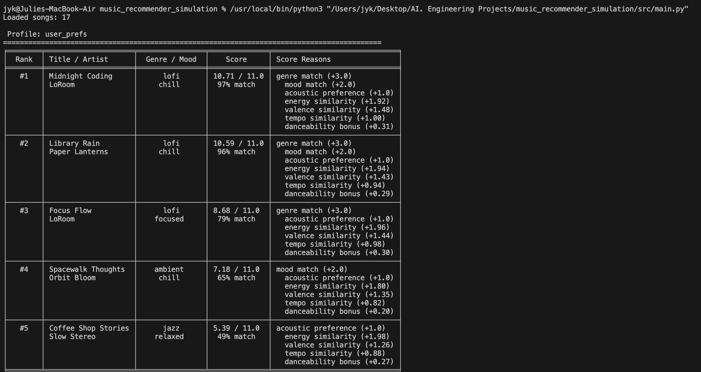
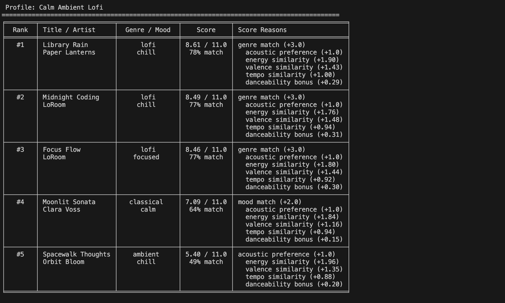
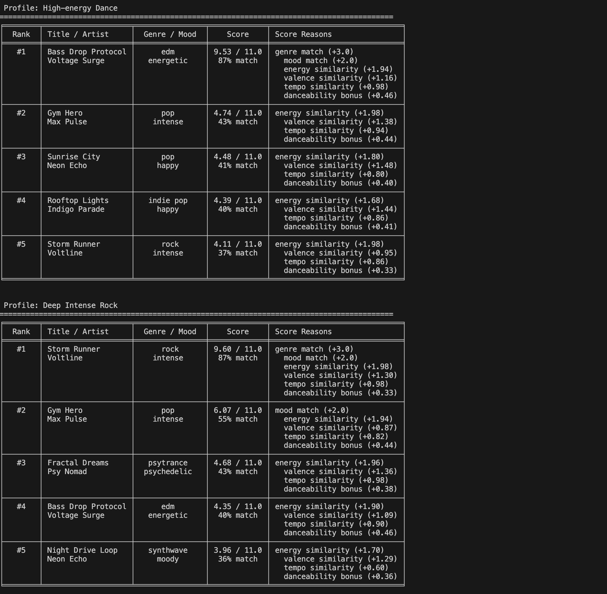

# 🎵 Music Recommender Simulation

## Project Summary

MusicMate Finder 1.0 is a content-based music recommender that scores songs against a user's taste profile — genre, mood, energy, valence, tempo, and acoustic preference — and returns the top 5 matches with score explanations. This simulation uses explicit user-defined preferences and a rule-based scoring function to surface relevant songs. The project explores how recommender logic is designed, where it works well, and where it can introduce bias or filter bubbles.

**Goals:**
- Represent songs and a user taste profile as data
- Design a scoring rule that turns that data into recommendations
- Evaluate what the system gets right and wrong
- Reflect on how this mirrors real-world AI recommenders
---

## How The System Works

Each `Song` has these attributes: `genre`, `mood`, `energy`, `tempo_bpm`, `valence`, `danceability`, and `acousticness`.

Each `UserProfile` stores: `favorite_genre`, `favorite_mood`, `target_energy`, `target_valence`, `target_tempo_bpm`, and `likes_acoustic`.

Every song is scored against the user profile and the top-5 results are returned with a breakdown of what drove each score.

**Categorical matches (binary)**

| Feature | Points | Notes |
|---|---|---|
| Genre match | +3.0 | Strongest taste signal |
| Mood match | +2.0 | Situational and highly intentional |
| Acoustic preference match | +1.0 | Awarded when `likes_acoustic` is true and `acousticness > 0.6` |
| Acoustic preference mismatch | -1.0 | Penalized when `likes_acoustic` is false and `acousticness > 0.6` |

**Continuous similarity (0 to max points)**

Closeness is rewarded gradually — a near miss still earns partial credit.

| Feature | Max Points | How it's calculated |
|---|---|---|
| Energy | 2.0 | `2.0 × (1 - │target_energy - song.energy│)` |
| Valence | 1.5 | `1.5 × (1 - │target_valence - song.valence│)` |
| Tempo | 1.0 | `1.0 × (1 - │target_tempo - song.tempo│ / 100)` |
| Danceability | 0.5 | Always-on bonus, not user-preference-weighted |

**Potential Biases**

- Genre and mood together make up 45% of the max score, which can overshadow strong sonic matches in other genres
- Danceability is awarded to every song regardless of whether the user cares about it, systematically favoring high-danceability genres like EDM and hip hop
- Most genres have only one song in the catalog, so a genre match often locks in a single result with no alternatives

**Maximum possible score: 11.0 points**

The final score can also be expressed as a match percentage (score ÷ 11.0) and is used in `explain_recommendation` to describe why a song was chosen.

**Data flow diagram**
[View Data Flow Diagram](flowchart.md)


---

## Getting Started

### Setup

1. Create a virtual environment (optional but recommended):

   ```bash
   python -m venv .venv
   source .venv/bin/activate      # Mac or Linux
   .venv\Scripts\activate         # Windows

2. Install dependencies

```bash
pip install -r requirements.txt
```

3. Run the app:

```bash
python -m src.main
```

## Demo

**User Preference Profile**


**Top 5 Recommendations**



---

### Running Tests

Run the starter tests with:

```bash
pytest
```

You can add more tests in `tests/test_recommender.py`.

---

## Experiments You Tried

- Tested three distinct user profiles (calm lofi, high-energy dance, deep rock) to see whether the top results matched expected genre and mood
- Tested edge cases with missing preference fields to confirm the system returned results without errors
- Observed that songs with no genre or mood match could still rank highly when energy and valence were strongly aligned — revealing the weight of continuous features

---

## Limitations and Risks

- The catalog only has 17 songs, so results are limited and many genres have just one option
- Genre and mood are exact string matches — similar but differently labeled songs score as complete misses
- Danceability is always rewarded regardless of user preference, creating an unintentional bias toward EDM and hip hop
- Missing large listener genre — no country, R&B, Latin, or K-pop

---

## Reflection

[**Model Card**](model_card.md)

Building this system made it clear how much a recommender's behavior is shaped by its scoring weights — a small change like raising the genre weight from 2.0 to 3.0 significantly narrows what gets recommended. It also showed how bias can be structural rather than intentional: the danceability bonus favors certain genres by default, not because of any deliberate choice but simply because the feature was added without tying it to user preference.

Working with AI tools throughout this project was genuinely useful from generating ideas and efficient development of the simulation.  But it also reinforced that double-checking with test cases matters. AI-generated code can look correct while quietly testing the wrong thing, so human review is still an essential part of the process.


