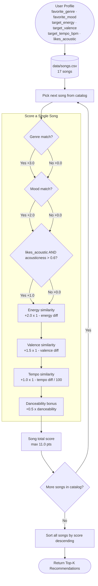

# Recommender Data Flow

```mermaid
flowchart TD
    A([User Profile\nfavorite_genre · favorite_mood\ntarget_energy · target_valence\ntarget_tempo_bpm · likes_acoustic]) --> B

    B[(data/songs.csv\n17 songs)] --> C

    C[Pick next song from catalog] --> D

    subgraph SCORE ["Score a Single Song"]
        D{Genre match?}
        D -- Yes +3.0 --> E
        D -- No +0.0 --> E

        E{Mood match?}
        E -- Yes +2.0 --> F
        E -- No +0.0 --> F

        F{likes_acoustic AND acousticness > 0.6?}
        F -- Yes +1.0 --> G
        F -- No +0.0 --> G

        G[Energy similarity\n+2.0 x 1 - energy diff] --> H
        H[Valence similarity\n+1.5 x 1 - valence diff] --> I
        I[Tempo similarity\n+1.0 x 1 - tempo diff / 100] --> J
        J[Danceability bonus\n+0.5 x danceability]
    end

    J --> K[Song total score\nmax 11.0 pts]
    K --> L{More songs in catalog?}
    L -- Yes --> C
    L -- No --> M[Sort all songs by score descending]
    M --> N([Return Top-K Recommendations])
```
